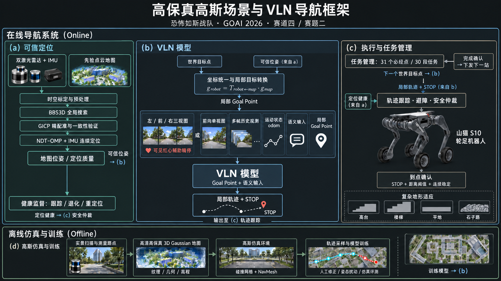
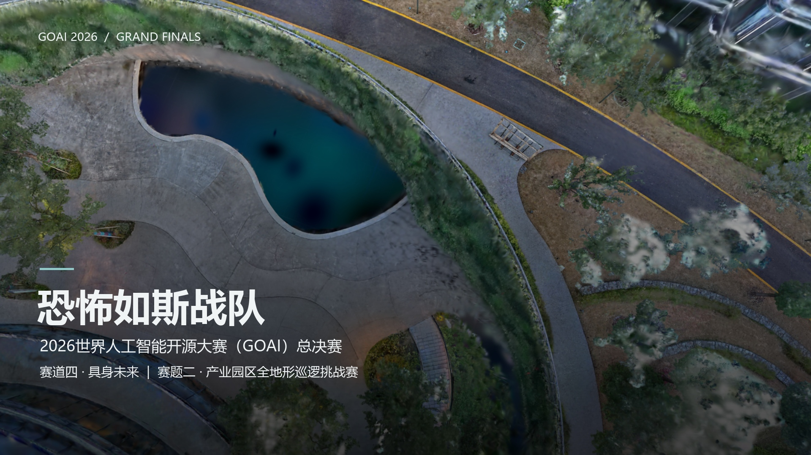

# 可靠定位助力视觉语言导航落地园区巡检

**恐怖如斯战队 | 2026 世界人工智能开源大赛（GOAI）总决赛 | 赛道四：具身未来 | 赛题二：产业园区全地形巡逻挑战赛**

面向云谷中心的 31 个必经目标点，我们将长路线拆解为 30 段逐站导航任务：机器人确认当前目标点后，才接收下一站。方案以高保真高斯场景构建训练与仿真环境，以可靠定位提供地图位姿，以视觉语言导航（VLN）理解视觉观测、语义指令和局部 Goal Point，最终由控制与安全层执行。

## 导航方案框架



框架包含四个相互衔接的部分：

1. **高保真场景与训练：**实景扫描生成高斯场景，结合碰撞网格和可通行区域，采样并校正逐站轨迹，用于模型训练和仿真验证。
2. **可靠定位：**双激光雷达与 IMU 支撑全局搜索、精配准和连续定位，输出地图坐标系中的机器人位姿及定位状态。世界坐标目标据此转换为机器人局部 Goal Point。
3. **视觉语言导航：**模型支持前向单视图或左、前、右三视图的纯视觉观测形式，并结合多帧信息、语义指令和局部 Goal Point 生成导航决策与 STOP。纯视觉观测能力不等于本次逐站到点评测未使用定位；精确目标引导仍由定位链路提供。
4. **安全执行与任务管理：**局部轨迹经过跟踪、避障与安全约束后驱动山猫 S10；当前站到点确认后再下发下一站。

## 完整方案讲解

点击封面观看 **64 秒完整讲解视频**，包含赛场场景、山猫 S10、上述框架，以及阶梯、绕石、穿草路段的模型仿真推理片段。

<video controls playsinline preload="metadata" poster="media/overview-poster.jpg" width="100%">
  <source src="media/overview-film-64s.mp4" type="video/mp4">
</video>

[](media/overview-film-64s.mp4)

[直接播放或下载 MP4](media/overview-film-64s.mp4)

## 逐路段仿真结果

当前展示的 epoch2 结果来自**同一云谷高斯仿真场景中的 30 段独立初始化任务**，不是一次无重置的连续实机巡逻。

| 指标 | 结果 |
| --- | ---: |
| 模型输出 STOP | 30 / 30 |
| STOP 且终点误差不超过 1 m | 30 / 30 |
| STOP 且终点误差不超过 0.25 m | 14 / 30 |
| 平均终点误差 | 0.255 m |
| 碰撞记录总数 | 41 |

高斯场景可在 [云谷中心三维场景](https://lcc-viewer.xgrids.cloud/pub/9e0212b2-49ff-419e-8c24-2c8a21e8bcc5) 中查看。框架展示、模型仿真评测与后续实机验证是不同层级的证据；上述数值不代表实机比赛成绩。

## 文件说明

```text
README.md                       本文档
media/navigation-framework.png  导航方案框架图
media/overview-poster.jpg       讲解视频封面
media/overview-film-64s.mp4     完整讲解视频
```

发布到魔搭仓库时，请将 `README.md` 与整个 `media/` 目录放在同一仓库根目录，以保持图片、封面和视频的相对链接有效。视频中的赛场画面和机器人产品图片来自项目展示素材；原始扫描资产、第三方模型和产品素材的再分发应分别遵守其授权条件。
